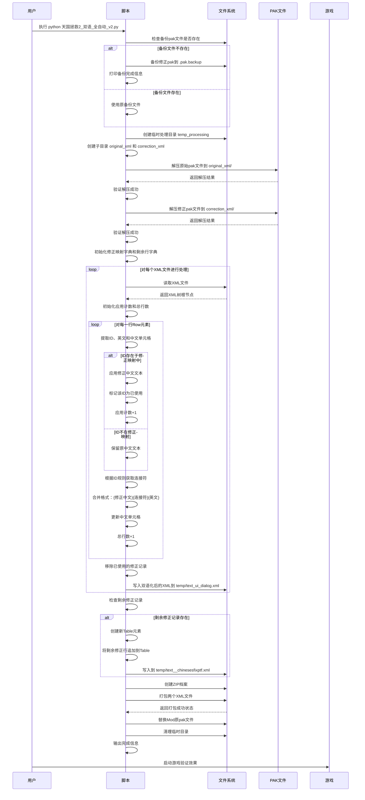
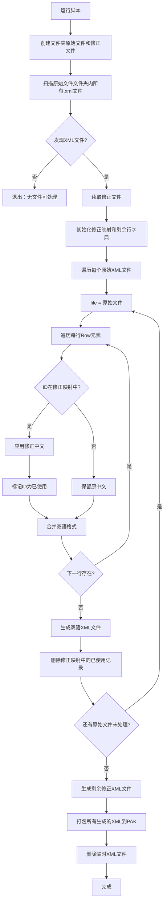

# Kingdom Come Deliverance 2 双语字幕工具包

## 项目简介

这是一个针对《Kingdom: New Life Coming》（天国拯救2）游戏的本地化工具包，提供全自动化的双语字幕处理功能。该工具包通过处理游戏的PAK本地化文件，实现中英文双语显示，并提供AI辅助翻译精校工具。

## 核心功能

- **自动化双语处理**：智能解压PAK文件，应用人工修正，生成双语版本
- **智能连接符适配**：根据UI元素类型自动选择合适的双语连接方式
- **版本迭代支持**：提供从通用处理到专用处理的多个版本脚本
- **AI翻译精校**：集成本地AI模型，提升翻译质量
- **备份与安全**：自动备份文件，确保操作安全

## 文件说明

- `天国拯救2_双语_全自动_v2.py` - 主处理脚本，专注于特定文件的高效处理
- `天国拯救2_双语_v1.py` - 通用处理脚本，支持批量文件处理
- `AI精校.py` - AI翻译精校工具（辅助性质，常用于提高基础翻译质量）

## 环境要求

- **操作系统**：Windows 10/11 (其他系统需手动调整路径)
- **Python版本**：3.7 或更高
- **依赖库**：
  - `xml.etree.ElementTree` (Python内置)
  - `requests` (可选，如需AI精校)
  - `pathlib` (Python内置)
  - `zipfile` (Python内置)
- **可选依赖**：Ollama本地AI服务（仅限AI精校功能）

## 快速安装

1. **克隆项目**：

```bash
git clone https://github.com/CooperZhuang/KingdomComeDeliverance2_BilingualSubtitles.git
cd KingdomComeDeliverance2_BilingualSubtitles
```

2. **停止游戏**：确保《Kingdom Come Deliverance 2》已完全关闭

3. **安装依赖**（可选，仅限AI精校）：

```bash
pip install requests
```

## 使用指南

### 主处理器使用 (v2版本，推荐)

#### 处理流程详解



#### 操作步骤

**确保Mod已正确安装，包含原始英文和中文翻译的包。**

```bash
python 天国拯救2_双语_全自动_v2.py
```

**预期输出**：

```log
🚀 开始天国拯救2特定文件自动化处理...

=== 步骤0: 备份修正文件 ===
📋 备份修正文件: Chineses_xml.pak.backup

=== 步骤1: 解压原始pak文件 ===
📦 正在解压: Chineses_xml.pak.original

=== 步骤2: 解压修正pak文件 ===
📦 正在解压: Chineses_xml.pak.backup

=== 步骤3: 读取修正数据 ===
✅ 已从修正文件读取 X 条修正记录。

=== 步骤4: 处理特定原始文件 ===
🔄 文件处理详情：总 Y 条，应用修正 Z 条。

=== 步骤5: 生成新的修正文件 ===
➕ 剩余修正记录...

=== 步骤6: 创建新的pak文件 ===
🎉 PAK打包成功！

🎉 特定文件自动化处理完成！

✅ 处理成功完成！
```

#### 默认路径设置

脚本内置默认路径：

- **游戏目录**：`C:/Program Files (x86)/Steam/steamapps/common/KingdomComeDeliverance2`
- **Mod目录**：`_BaseGameMods/chinesesfixptf/Localization/`

如需修改，请编辑脚本`__init__`方法中的路径配置。

### 通用处理器使用 (v1版本)

适用于处理多个XML文件的场景。

#### 处理流程



#### 使用方法

1. **创建文件夹结构**：

```cmd
mkdir "原始文件"
mkdir "修正文件"
```

2. **准备文件**：

   - 将游戏中的原始XML文件放入`原始文件/`文件夹
   - 将修正XML文件放入`修正文件/text__chinesesfixptf.xml`

3. **运行处理**：

```bash
python 天国拯救2_双语_v1.py
```

**输出**：PAK文件将直接在脚本同级目录生成。

### AI精校工具使用

**⚠️ 重要提醒：此工具仅作为辅助，翻译精校质量取决于AI模型的训练数据和本地化质量。实际效果因人而异，请谨慎使用。**

#### 处理流程

```mermaid
stateDiagram-v2
    [*] --> 读取配置文件
    读取配置文件 --> 选择模式

    state if_test_mode <<choice>>
    选择模式 --> if_test_mode: 是否测试模式
    if_test_mode --> 测试数据: 是
    if_test_mode --> 文件模式: 否

    测试数据 --> 解析硬编码XML
    文件模式 --> 检查文件存在
    检查文件存在 --> 解析实际XML文件: 文件存在
    检查文件存在 --> 创建示例文件: 文件不存在

    state xml_parse <<choice>>
    解析硬编码XML --> xml_parse
    解析实际XML文件 --> xml_parse
    创建示例文件 --> xml_parse

    xml_parse --> 提取单元格
    提取单元格 --> 分割中文和英文部分
    分割中文和英文部分 --> 调用OllamaAPI

    调用OllamaAPI --> wait
    wait --> receive_response: 接收精校后文本
    receive_response --> 组合新Cell内容

    组合新Cell内容 --> check_next_row: 是否还有行待处理?
    check_next_row --> yes: 提取单元格
    yes --> 分割中文和英文部分
    check_next_row --> no --> 保存文件

    保存文件 --> 输出完成信息
    输出完成信息 --> [*]

    state wait as "调用AI精校后等待"

    note right of AI精校 : AI精校的具体流程
    AI精校 --> Prompt构造
    Prompt构造 --> 发送请求
    发送请求 --> 接收响应
    接收响应 --> 返回精校文本
```

#### 使用步骤

1. **安装Ollama**：
   - 下载并安装Ollama：<https://github.com/jmorganca/ollama/releases>
   - 拉取模型：`ollama pull qwen3:latest`

2. **启动Ollama服务**：
   - 命令行运行：`ollama serve`

3. **准备文件**：确保`game_localization.xml`存在并包含双语格式的翻译对

4. **修改配置**：将`IS_TEST_MODE = False`

5. **执行精校**：

```bash
python AI精校.py
```

**处理示例输出**：

```log
--- 运行模式：实际文件模式 ---
开始处理 X 行数据 (数据源: game_localization.xml)...
--- 正在处理第 1 行 ---
英文: What next? I found Janosh, but where the fuck is Adder?
原中文: 然后呢？我找到了亚诺什，但阿德尔他妈的在哪？
精校后中文: 接下来怎么办？我找到了亚诺什，但阿德尔到底在哪里？
...
--- 任务完成 ---
结果已保存至：game_localization_refined.xml
```

## 技术详解

### 双语合并规则

- **默认连接符**：用 `" \\n "` 连接中文和英文
- **UI名前缀规则**：ID开头为`ui_nm`的条目用 `"  "` (两个空格)连接
- **格式示例**：
  - 普通对话：`中文内容 \\n 英文内容`
  - UI名称：`中文名称  英文名称`

### PAK文件结构

由于游戏使用ZIP格式的PAK文件，XML解析基于标准ElementTree：

```xml
<Table>
    <Row>
        <Cell>unique_id</Cell>
        <Cell>英语文本</Cell>
        <Cell>中文文本</Cell>
    </Row>
    <!-- 更多行... -->
</Table>
```

### AI精校技术细节

- **API接口**：`/api/generate` (Ollama本地推理)
- **模型参数**：
  - 温度：0.1 (低创意，高精确性)
  - 格式：仅返回精校后中文，不含解释
- **Prompt模板**：包含游戏本地化上下文，确保口语化和文化适配

## 故障排除

### 常见问题

1. **路径错误**
   - 确认游戏已通过Steam安装在默认路径
   - 检查Mod目录结构是否正确：`Mods/chinesesfixptf/Localization/Chineses_xml.pak`

2. **解压失败**
   - 确保PAK文件未被其他程序占用
   - 检查文件完整性

3. **无效果显示**
   - 确认Mod已启用
   - 重启游戏后验证

4. **AI精校连接失败**
   - 检查Ollama服务状态：`curl http://localhost:11434/api/tags`
   - 确认模型已下载：`ollama list`

### 日志解读

- `❌ 错误：` - 需要立即处理的问题
- `⚠️ 警告：` - 非关键问题，处理会继续
- `✅` - 成功状态指示
- `📦` - 文件操作进度

## 文件结构说明

```
temp_processing/ (运行时创建，完成后删除)
├── original_xml/
│   └── text_ui_dialog.xml (解压后的原始中文本地化)
├── correction_xml/
│   └── text__chinesesfixptf.xml (解压后的修正本地化)
├── text_ui_dialog.xml (双语化结果)
└── text__chinesesfixptf.xml (剩余修正，未使用的修正条目)

Mods/chinesesfixptf/Localization/
├── Chineses_xml.pak (最终PAK，包含以上两个XML文件的ZIP)
└── Chineses_xml.pak.backup (自动备份)
```

## 许可证

本项目采用MIT许可证。

## 作者

Cooper Zhuang
